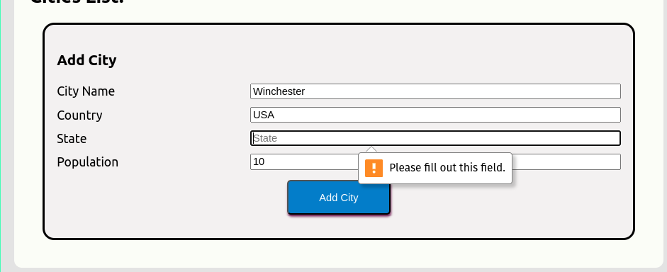
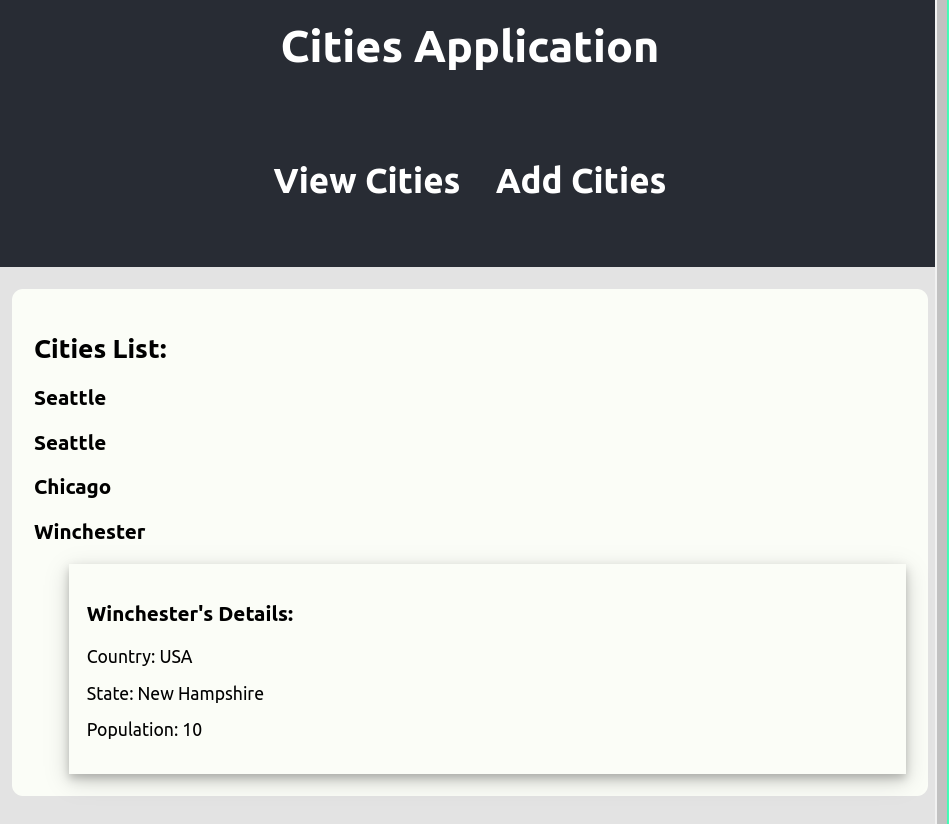

# PE 4

### Assignment: 

Create an app that would render a list of objects and allow a user to add cities to a list. The list displays the city name
if the user clicks on the user, they can see details. 

##### Components:

The application used three components, Cities Card and AddCity. Cities toggle between displaying the city list and the 
AddCity Component. AddCity component allows user to add city records. These records are held in state.  

#### Input: 

- AddCity takes user input. The Components is passed a function form the Cities component that allows it to add a city record
to state and toggle the view to the city list.


- The input checks to make sure that all fields are present
'


#### Process: 

- App: renders a Cities component.
- AddCities: Allow user to add city records
- Card: holds city data and toggles the data

#### Model: 

The data is in a list of JSON objects. As shown below. This is rendered recursively as described in process. 

```json
{
  city_name: "",
  country: "",
  state: "",
  population: ""
}
```


