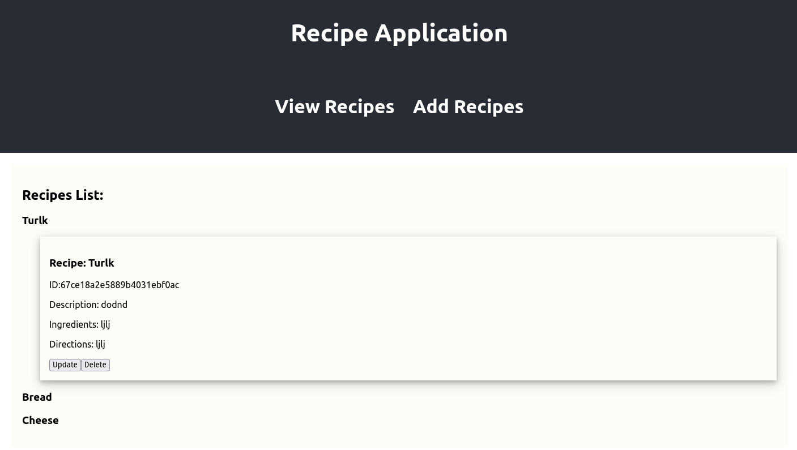
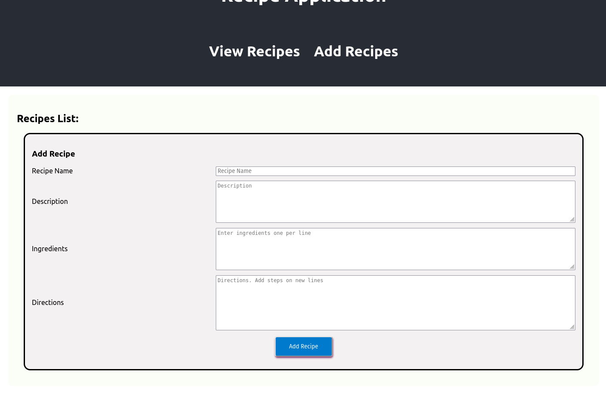
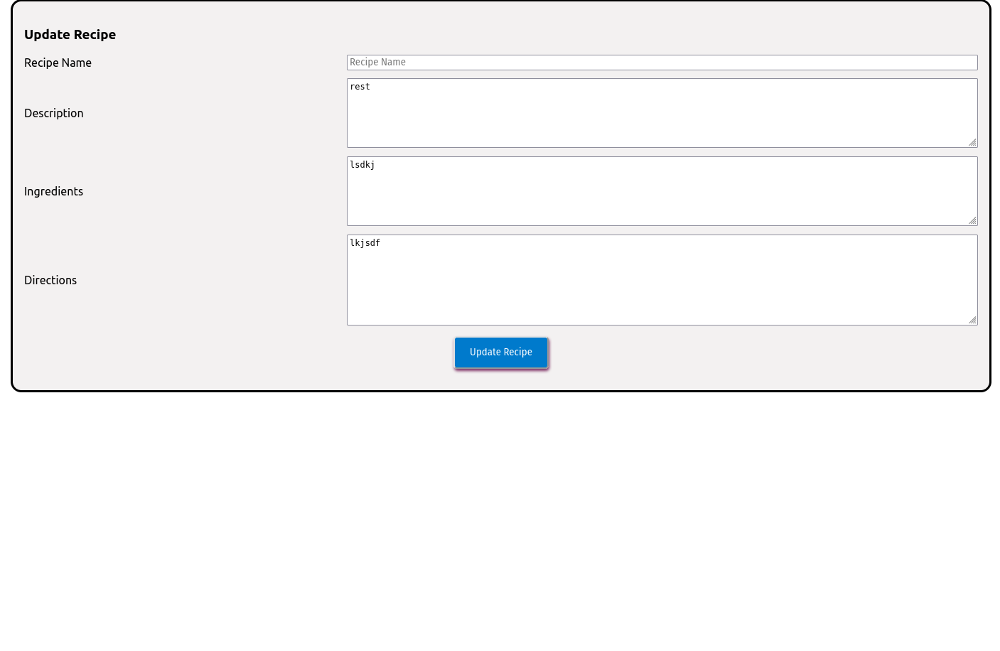

# PE 5

### Assignment:

Create an app that would render a list of objects and allow a user to add to a list. The list displays the recipe name. 
The user can click on the title to see details of the recipe.


##### Components:

The application uses four components, Recipes List, Card, AddRecipe and UpdateRecipe. In the Recipe component user can
toggle between displaying the recipe list and the AddRecipe component. AddRecipe component allows user to add recipe records. 
These records are held in state.

##### Backend

The backend is a express app and is mostly used to connect the React app and mongodb server together. In the backend there is the route 
http://localhost:5050/recipes. There is a get all, get by id, post, patch and delete to accommodate CRUD operations. 

##### Database

The app spored data in a mongodb noSQL database. The database is hosted on Mongo Atlas were the app stores its data. 

#### Input:

- AddRecipe takes user input. The app treats the Database as the source of truth os it does not attempt sync state of the 
app and the database. When a suer adds a new recipe to the app it adds the app to the backend. When the user navigates to 
a different part of the front end this triggers a hock to refresh the data by calling it from the backend. This is not really 
scalable but works for this application. 

Recipe:



Add Recipe:



Update Recipe:



- The input checks to make sure that all fields are present

#### Process:

- App: renders a Recipes component.
- AddRecipe: Allow user to add recipe records
- Card: holds city data and toggles the data

#### Model:

The data is in a list of JSON objects. As shown below. This is rendered recursively as described in process.
Again this isn't very scalable. A better solution could as schema to make sure that the data was consistent, but it works 
here.
```json
{
  "recipe_name": "",
  "description": "",
  "ingredients": "",
  "directions": ""
}
```
